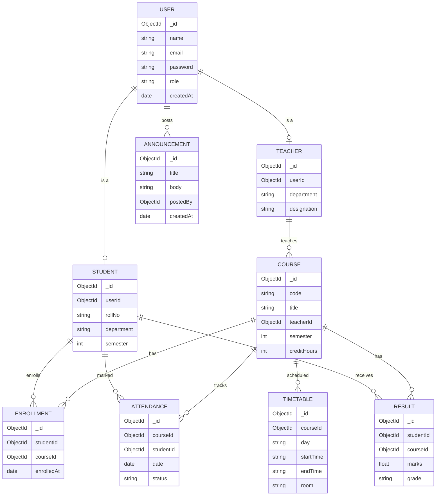

# Database Design (ERD) & API List
## University Super App

---

## 1. Entity Relationship Diagram



### Relationship notes
- One **User** is either a **Student** or a **Teacher** (role field decides which profile applies).
- One **Teacher** teaches many **Courses**; one **Course** has one **Teacher**.
- **Enrollment** is the join table between **Student** and **Course** (many-to-many).
- One **Course** has many **Timetable** slots, **Attendance** records and **Results**.
- **Announcement** can be posted by any user with role `teacher` or `admin`.

---

## 2. API List

Base URL: `/api`
All protected routes require header: `Authorization: Bearer <token>`

### 2.1 Auth
| Method | Endpoint | Access | Body / Params | Response |
|---|---|---|---|---|
| POST | `/auth/register` | Admin only | name, email, password, role | user object |
| POST | `/auth/login` | Public | email, password | token, user |
| GET | `/auth/me` | Logged-in user | — | current user |
| POST | `/auth/change-password` | Logged-in user | oldPassword, newPassword | success message |

### 2.2 Users / Profile
| Method | Endpoint | Access | Body / Params | Response |
|---|---|---|---|---|
| GET | `/users/:id` | Self or Admin | — | user profile |
| PUT | `/users/:id` | Self or Admin | phone, photo, etc. | updated user |
| GET | `/users` | Admin only | ?role= | list of users |
| DELETE | `/users/:id` | Admin only | — | success message |

### 2.3 Courses
| Method | Endpoint | Access | Body / Params | Response |
|---|---|---|---|---|
| POST | `/courses` | Admin | code, title, teacherId, semester, creditHours | course object |
| GET | `/courses` | All | ?semester= | list of courses |
| GET | `/courses/:id` | All | — | course details |
| PUT | `/courses/:id` | Admin | fields to update | updated course |
| DELETE | `/courses/:id` | Admin | — | success message |
| POST | `/courses/:id/enroll` | Admin | studentId | enrollment object |
| GET | `/courses/:id/students` | Teacher, Admin | — | list of enrolled students |
| GET | `/students/:id/courses` | Student (self), Admin | — | list of courses |

### 2.4 Timetable
| Method | Endpoint | Access | Body / Params | Response |
|---|---|---|---|---|
| POST | `/timetable` | Admin | courseId, day, startTime, endTime, room | timetable entry |
| GET | `/timetable/me` | Student, Teacher | — | own weekly schedule |
| PUT | `/timetable/:id` | Admin | fields to update | updated entry |
| DELETE | `/timetable/:id` | Admin | — | success message |

### 2.5 Announcements
| Method | Endpoint | Access | Body / Params | Response |
|---|---|---|---|---|
| POST | `/announcements` | Teacher, Admin | title, body | announcement object |
| GET | `/announcements` | All | ?page= | list, newest first |
| PUT | `/announcements/:id` | Owner only | title, body | updated announcement |
| DELETE | `/announcements/:id` | Owner, Admin | — | success message |

### 2.6 Attendance
| Method | Endpoint | Access | Body / Params | Response |
|---|---|---|---|---|
| POST | `/attendance` | Teacher | courseId, date, records: [{studentId, status}] | saved records |
| GET | `/attendance/course/:courseId` | Teacher, Admin | ?date= | attendance list |
| GET | `/attendance/student/:studentId` | Student (self), Admin | ?courseId= | attendance % per course |

### 2.7 Results
| Method | Endpoint | Access | Body / Params | Response |
|---|---|---|---|---|
| POST | `/results` | Teacher | studentId, courseId, marks, grade | result object |
| GET | `/results/student/:studentId` | Student (self), Admin | — | results + GPA |
| PUT | `/results/:id` | Teacher | marks, grade | updated result |

---

## 3. Standard Response Format

**Success:**
```json
{ "success": true, "data": { } }
```

**Error:**
```json
{ "success": false, "message": "Error description" }
```

## 4. HTTP Status Codes Used
| Code | Meaning |
|---|---|
| 200 | Success |
| 201 | Created |
| 400 | Bad request / validation error |
| 401 | Unauthorized (no/invalid token) |
| 403 | Forbidden (wrong role) |
| 404 | Not found |
| 500 | Server error |
