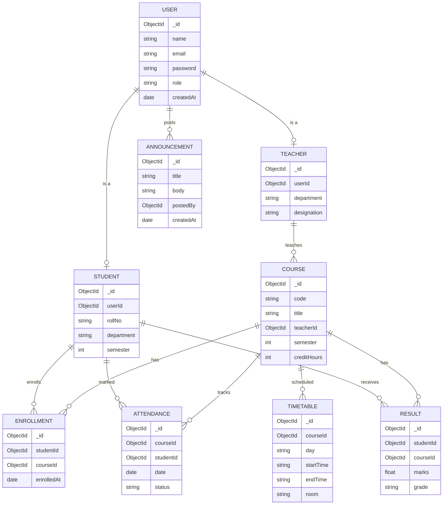

# Database Design (ERD) & API List
## University Super App

**Stack:** Next.js (App Router) — all API endpoints below are implemented as
Next.js Route Handlers under `client/app/api/`, not a separate Express server.
Example: `GET /api/courses` lives at `client/app/api/courses/route.ts`.

---

## 1. Entity Relationship Diagram


```mermaid
erDiagram
    USER ||--o| STUDENT : "is a"
    USER ||--o| TEACHER : "is a"
    TEACHER ||--o{ COURSE : teaches
    COURSE ||--o{ ENROLLMENT : has
    STUDENT ||--o{ ENROLLMENT : enrolls
    COURSE ||--o{ TIMETABLE : scheduled
    USER ||--o{ ANNOUNCEMENT : posts
    COURSE ||--o{ ATTENDANCE : tracks
    STUDENT ||--o{ ATTENDANCE : marked
    COURSE ||--o{ RESULT : has
    STUDENT ||--o{ RESULT : receives

    USER {
        ObjectId _id
        string name
        string email
        string password
        string role
        date createdAt
    }
    STUDENT {
        ObjectId _id
        ObjectId userId
        string rollNo
        string department
        int semester
    }
    TEACHER {
        ObjectId _id
        ObjectId userId
        string department
        string designation
    }
    COURSE {
        ObjectId _id
        string code
        string title
        ObjectId teacherId
        int semester
        int creditHours
    }
    ENROLLMENT {
        ObjectId _id
        ObjectId studentId
        ObjectId courseId
        date enrolledAt
    }
    TIMETABLE {
        ObjectId _id
        ObjectId courseId
        string day
        string startTime
        string endTime
        string room
    }
    ANNOUNCEMENT {
        ObjectId _id
        string title
        string body
        ObjectId postedBy
        date createdAt
    }
    ATTENDANCE {
        ObjectId _id
        ObjectId courseId
        ObjectId studentId
        date date
        string status
    }
    RESULT {
        ObjectId _id
        ObjectId studentId
        ObjectId courseId
        float marks
        string grade
    }
```

### Relationship notes
- One **User** is either a **Student** or a **Teacher** (role field decides which profile applies).
- One **Teacher** teaches many **Courses**; one **Course** has one **Teacher**.
- **Enrollment** is the join table between **Student** and **Course** (many-to-many).
- One **Course** has many **Timetable** slots, **Attendance** records and **Results**.
- **Announcement.postedBy** references **User** directly.
- `studentId` / `teacherId` fields in **Enrollment**, **Timetable**, **Attendance** and **Result** reference the **Student** / **Teacher** collections (not User directly).
- **User** also carries `phone`, `photo` and `isActive` (used for soft-delete via `DELETE /api/users/:id`).

---

## 2. API List

Base URL: `/api` (relative to the deployed Next.js app, e.g. `https://<app>.vercel.app/api`)
All protected routes are guarded by an Auth.js session — no manual token header needed
in the browser; server-side handlers read the session via `auth()`.

### 2.1 Auth (Auth.js)
| Method | Endpoint | Access | Notes |
|---|---|---|---|
| GET/POST | `/auth/[...nextauth]` | Public | Handled entirely by Auth.js (sign in, sign out, session, callback) |
| POST | `/auth/register` | Admin only | Custom route: name, email, password, role → creates user (password hashed) |
| GET | `/auth/me` | Logged-in user | Returns current session user |
| POST | `/auth/change-password` | Logged-in user | oldPassword, newPassword → success message |

### 2.2 Users / Profile
| Method | Endpoint | Access | Body / Params | Response |
|---|---|---|---|---|
| GET | `/users/:id` | Self or Admin | — | user profile |
| PUT | `/users/:id` | Self or Admin | phone, photo, etc. | updated user |
| GET | `/users` | Admin only | ?role= | list of users |
| DELETE | `/users/:id` | Admin only | — | soft delete — sets `isActive: false` |
| GET | `/students/:id` | Self or Admin | — | student profile |
| GET | `/teachers` | Admin | — | list of teachers |
| GET | `/teachers/:id` | Self or Admin | — | teacher profile |

### 2.3 Courses
| Method | Endpoint | Access | Body / Params | Response |
|---|---|---|---|---|
| POST | `/courses` | Admin | code, title, teacherId, semester, creditHours | course object |
| GET | `/courses` | All | ?semester= | list of courses |
| GET | `/courses/:id` | All | — | course details |
| PUT | `/courses/:id` | Admin | fields to update | updated course |
| DELETE | `/courses/:id` | Admin | — | success message |
| POST | `/courses/:id/enroll` | Admin | studentId | enrollment object |
| GET | `/courses/:id/students` | Teacher, Admin | — | list of enrolled students |
| GET | `/students/:id/courses` | Student (self), Admin | — | list of courses |

### 2.4 Timetable
| Method | Endpoint | Access | Body / Params | Response |
|---|---|---|---|---|
| POST | `/timetable` | Admin | courseId, day, startTime, endTime, room | timetable entry |
| GET | `/timetable/me` | Student, Teacher | — | own weekly schedule |
| PUT | `/timetable/:id` | Admin | fields to update | updated entry |
| DELETE | `/timetable/:id` | Admin | — | success message |

### 2.5 Announcements
| Method | Endpoint | Access | Body / Params | Response |
|---|---|---|---|---|
| POST | `/announcements` | Teacher, Admin | title, body | announcement object |
| GET | `/announcements` | All | ?page= | list, newest first |
| PUT | `/announcements/:id` | Owner only | title, body | updated announcement |
| DELETE | `/announcements/:id` | Owner, Admin | — | success message |

### 2.6 Attendance
| Method | Endpoint | Access | Body / Params | Response |
|---|---|---|---|---|
| POST | `/attendance` | Teacher | courseId, date, records: [{studentId, status}] | saved records |
| GET | `/attendance/course/:courseId` | Teacher, Admin | ?date= | attendance list |
| GET | `/attendance/student/:studentId` | Student (self), Admin | ?courseId= | attendance % per course |

### 2.7 Results
| Method | Endpoint | Access | Body / Params | Response |
|---|---|---|---|---|
| POST | `/results` | Teacher | studentId, courseId, marks, grade | result object |
| GET | `/results/student/:studentId` | Student (self), Admin | — | results + GPA |
| PUT | `/results/:id` | Teacher | marks, grade | updated result |

---

## 3. Standard Response Format

**Success:**
```json
{ "success": true, "data": { } }
```

**Error:**
```json
{ "success": false, "message": "Error description" }
```

## 4. HTTP Status Codes Used
| Code | Meaning |
|---|---|
| 200 | Success |
| 201 | Created |
| 400 | Bad request / validation error |
| 401 | Unauthorized (no/invalid token) |
| 403 | Forbidden (wrong role) |
| 404 | Not found |
| 500 | Server error |
